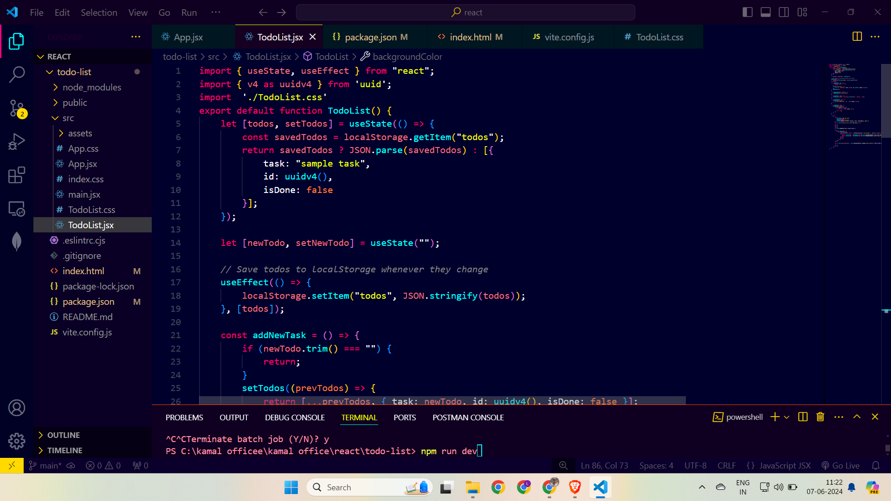
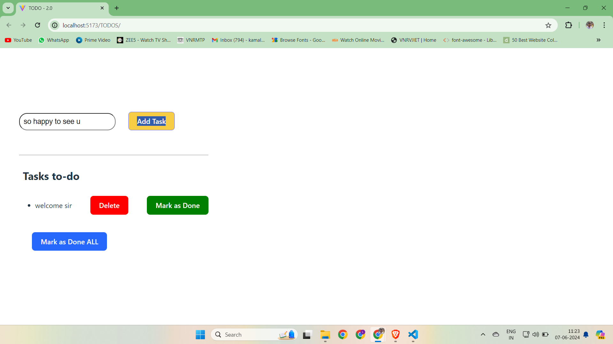
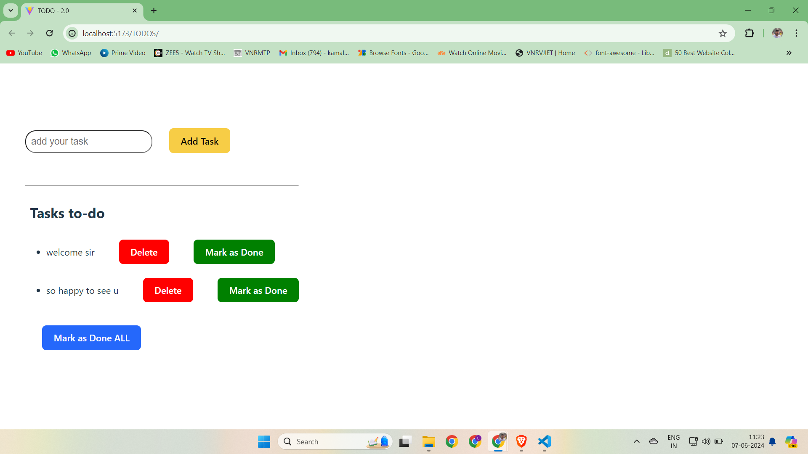
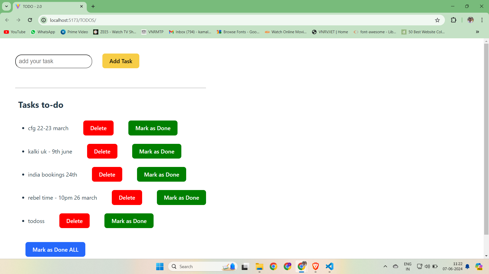

# Todo-List  Application with MARK AS DONE feature

This is a simple Todo List application built with React. It allows users to add, delete, and mark tasks as done. The tasks are persisted in the browser's `localStorage`, so they remain even after refreshing the page.

## Features

- Add new tasks to the list
- Delete tasks from the list
- Mark individual tasks as done
- Mark all tasks as done
- Persist tasks in `localStorage`

## Installation

To get started with the Todo List application, follow these steps:

1. **Clone the repository:**

    ```bash
    git clone https://github.com/your-username/todo-list-app.git
    cd todo-list-app
    ```

2. **Install dependencies:**

    ```bash
    npm install
    ```

3. **Start the development server:**

    ```bash
    npm start
    ```

    The application will be available at `http://localhost:3000`.

## Code Explanation

### Import Statements

```javascript
import { useState, useEffect } from "react";
import { v4 as uuidv4 } from 'uuid';
```

- We import `useState` and `useEffect` from React.
- We import `uuidv4` from the `uuid` library to generate unique IDs for each todo item.

### Function Definition

```javascript
export default function TodoList() {
```

- We define a functional React component named `TodoList`.

### State Initialization

```javascript
let [todos, setTodos] = useState(() => {
    const savedTodos = localStorage.getItem("todos");
    return savedTodos ? JSON.parse(savedTodos) : [{
        task: "sample task",
        id: uuidv4(),
        isDone: false
    }];
});
```

- We use the `useState` hook to create a state variable `todos` and its setter function `setTodos`.
- We initialize `todos` using a function that:
  - Checks if there are todos stored in `localStorage`.
  - If yes, parses and returns them.
  - If no, returns an array with a single sample task.

### New Todo State

```javascript
let [newTodo, setNewTodo] = useState("");
```

- We create another state variable `newTodo` and its setter function `setNewTodo` to manage the input value for a new todo item.

### Effect Hook for Saving Todos

```javascript
useEffect(() => {
    localStorage.setItem("todos", JSON.stringify(todos));
}, [todos]);
```

- We use the `useEffect` hook to save the `todos` array to `localStorage` whenever `todos` state changes.

### Add New Task Function

```javascript
const addNewTask = () => {
    if (newTodo.trim() === "") {
        return;
    }
    setTodos((prevTodos) => {
        return [...prevTodos, { task: newTodo, id: uuidv4(), isDone: false }];
    });
    setNewTodo("");
};
```

- We define a function `addNewTask` that:
  - Checks if `newTodo` is empty or contains only whitespace. If so, it returns early.
  - Uses `setTodos` to add a new task to the `todos` array.
  - Resets the `newTodo` state to an empty string.

### Update Todo Value Function

```javascript
const updateTodoValue = (event) => {
    setNewTodo(event.target.value);
};
```

- We define a function `updateTodoValue` that updates `newTodo` state with the value from the input field.

### Delete Todo Function

```javascript
const deleteTodo = (id) => {
    setTodos((prevTodos) => prevTodos.filter((todo) => todo.id !== id));
};
```

- We define a function `deleteTodo` that removes a todo item by its ID from the `todos` array.

### Mark All As Done Function

```javascript
const markAsDoneAll = () => {
    setTodos((prevTodos) => 
        prevTodos.map((todo) => ({ ...todo, isDone: true }))
    );
};
```

- We define a function `markAsDoneAll` that marks all todo items as done.

### Mark Single Todo As Done Function

```javascript
const markAsDone = (id) => {
    setTodos((prevTodos) =>
        prevTodos.map((todo) => {
            if (todo.id === id) {
                return { ...todo, isDone: true };
            }
            return todo;
        })
    );
};
```

- We define a function `markAsDone` that marks a specific todo item as done by its ID.

### JSX Return

```javascript
return (
    <>
        <input
            placeholder="add your task"
            value={newTodo}
            onChange={updateTodoValue}
            style={{ padding: "0.8rem", fontSize: "20px", borderRadius: "20px" }}
        /> &nbsp;
        <br />
        <br />
        <button onClick={addNewTask}>Add Task</button>

        <br />
        <br />
        <br />
        <hr />
        <h4>Tasks to-do</h4>

        <ul>
            {todos.map((todo) => (
                <li key={todo.id}>
                    <span style={todo.isDone ? { textDecorationLine: "line-through" } : {}}>{todo.task}</span> &nbsp;&nbsp;
                    <span>
                        <button onClick={() => deleteTodo(todo.id)}>Delete</button> &nbsp;&nbsp;
                        <button onClick={() => markAsDone(todo.id)}>Mark as Done</button>
                    </span>
                    <br />
                    <br />
                </li>
            ))}
        </ul>

        <button onClick={markAsDoneAll}>Mark as Done ALL</button>

        <br />
        <br />
    </>
);
}
```

- The component renders a form with an input field for adding new tasks, a button to add the task, and a list of current tasks.
- Each task in the list has buttons to delete the task or mark it as done.
- There is a button to mark all tasks as done.

## Key Features:

- **Input Field:** Allows the user to type a new task.
- **Add Task Button:** Adds the typed task to the list.
- **Task List:** Displays all tasks, each with options to delete or mark as done.
- **Mark All Done Button:** Marks all tasks as done.

## Conclusion

This Todo List application is a basic example of a React app that uses `localStorage` for persistence. It demonstrates the use of React hooks (`useState` and `useEffect`) for state management and side effects.

Feel free to fork this repository and add more features to enhance the functionality of the Todo List application!

---
## Demonstration








